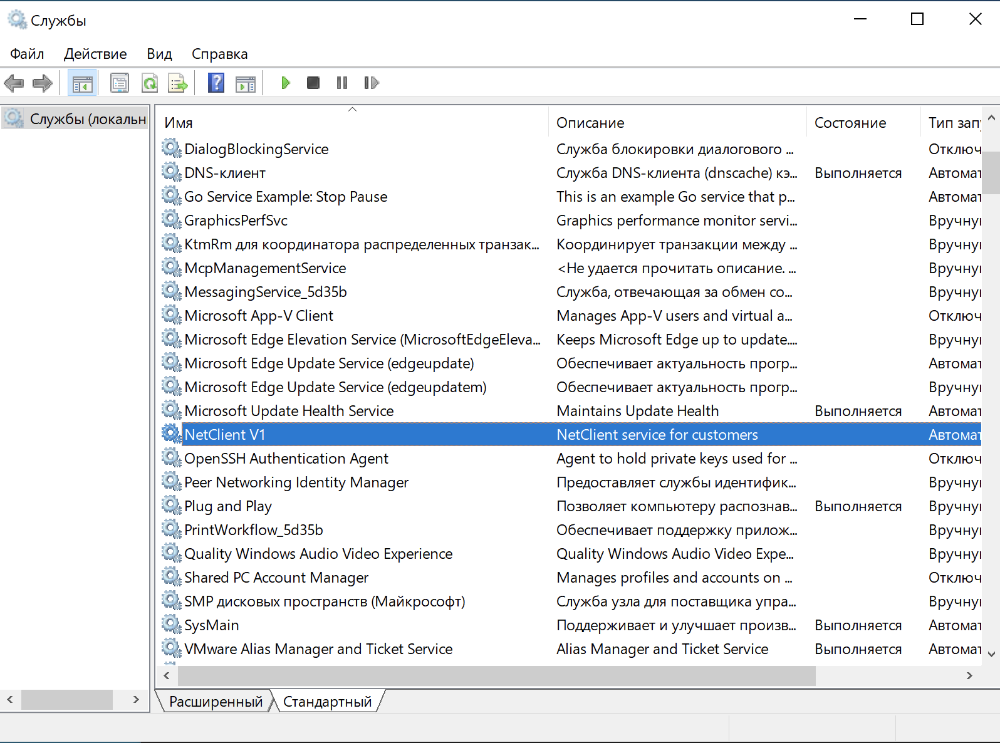

<<<<<<< HEAD
____
## NetClient v1
Служба, которая сканирует все сетевые интерфейсы компьютера и отправляет данные на [сервер](../netserver/readme.md) при старте ОС:
	- Название интерфейса;
	- MAC-адрес;
	- IP-адрес;
	- MTU.

### Windows client:
	1) Собрать .exe файл: GOOS=windows GOARCH=amd64 go install;
	2) Загрузить netclient.exe файл на клиентский компьютер;
	3) Перейти в директорию с исполняемым файлом;
	4) \netclient.exe install  - устанавливает службу;
	5) перезагрузить компьютер или ввести команду netclient.exe start.
=======
1) GOOS=windows GOARCH=amd64 go build .
>>>>>>> 479c6f2 (rebuild backend-netserver-netclient API)
